# Image Classification of the CIFAR-10 Dataset

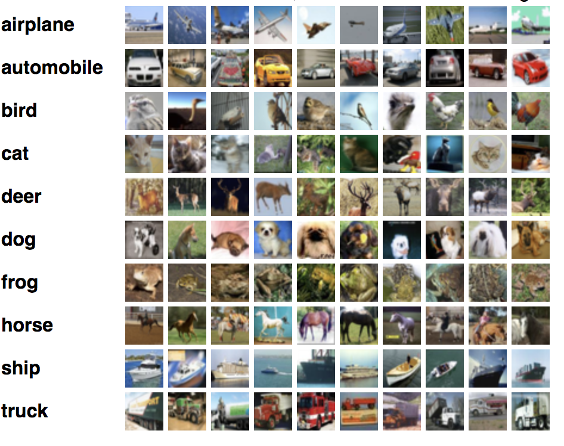

July, 2018

Evan Hosmer, Alan Teran and Tim Marlowe

### Overview

The goal of this case study was to classify images from the CIFAR-10 dataset. The CIFAR-10 dataset contains 32x32 images in 10 different classes. The original datset contains 60000 images, but a batch of 10000 images was used due to time constraints. The images were trained on a convolutional neural network with a training set of 8000 images and a test set of 2000 images.

The classes of the images are:
- airplane (1005 photos)
- automobile (974 photos)
- bird (1032 photos)
- cat (1016 photos)
- deer (999 photos)
- dog (937 photos)
- frog (1030 photos)
- horse (1001 photos)
- ship (1025 photos)
- truck (981 photos)

### Image Pre Processing

Each batch contained a dictionary of labels and data for the 10000 photos. Data was inputed as a 1000 x 3072 numpy array
with the first 1024 entries containing the red channel values, the next 1024 the green, and the final 1024 the blue. To use this data in the neural network, the data array was reshaped to be an array of 32x32 matricies that represent each of the photos.

```
    def change_dimensions(df):
    ''' Compile the 3 dimensions of the images and standardize the values'''

    X = df[b'data']
    new_X = []
    for idx in range(X.shape[0]):
        img=df[b'data'][idx].reshape(32,32,3)
        img_new= np.stack([img.reshape(3,32,32)[0],
                      img.reshape(3,32,32)[1],
                      img.reshape(3,32,32)[2]],
                      axis=2)
        new_X.append(img_new)
    X_array = np.array(new_X)
    X_stand = np.array(X_array, dtype="float") / 255.0
    return X_stand
```

### Base Architecture


| Layer        | Filters        | Type          | Activation    | MaxPooling    | Dropout |
| ------------- |:-------------:| -------------:| ------------- |:-------------:| -----:|
| 1           |         48      | Convolution2D |       ReLU    |     No         |  No  |
| 2           |         48      | Convolution2D |       ReLU    |    Yes         | Yes  |
| 3           |         96      | Convolution2D |       ReLU    |    No          |  No  |
| 4           |         96      | Convolution2D |       ReLU    |    Yes         | Yes  |
| 5           |         192     | Convolution2D |       ReLU    |    No          |  No  |
| 6           |         192     | Convolution2D |       ReLU    |    Yes         | Yes  |
| 7           |         512     | Dense         |       ReLU    |    No          | Yes  |
| 8           |         256     | Dense         |       ReLU    |    No          | Yes  |
| 9           |         10      | Dense         |       Softmax    |    No          |  No  |

https://github.com/parneetk/Neural-Networks-in-Keras/blob/master/03_CNN_CIFAR10.ipynb


### Hyperparameter Tuning

For hyperparameter tuning we modified the following:
- Number of layers
- Batch Size
- Number of epochs
- Augmentation

### Model performance

__Model 1__

Architecture: Base, Batch: 500, Epochs: 30, Test Acc: .632, Test Loss: 1.23

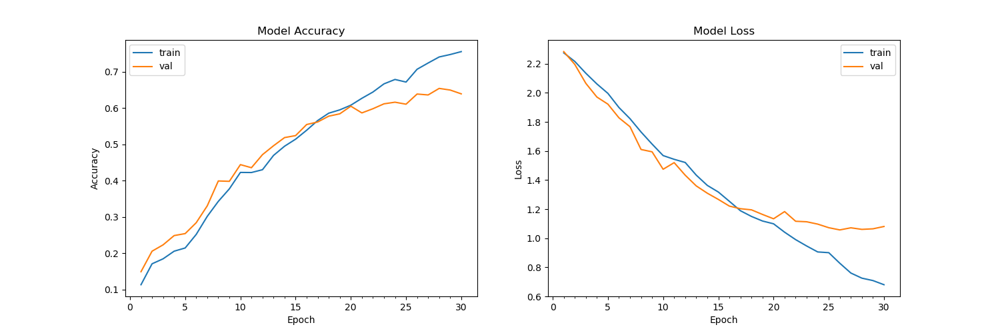

__Model 2__

Architecture: Base, Batch: 250, Epochs: 35, Test Accuracy: .662, Test Loss: 1.19

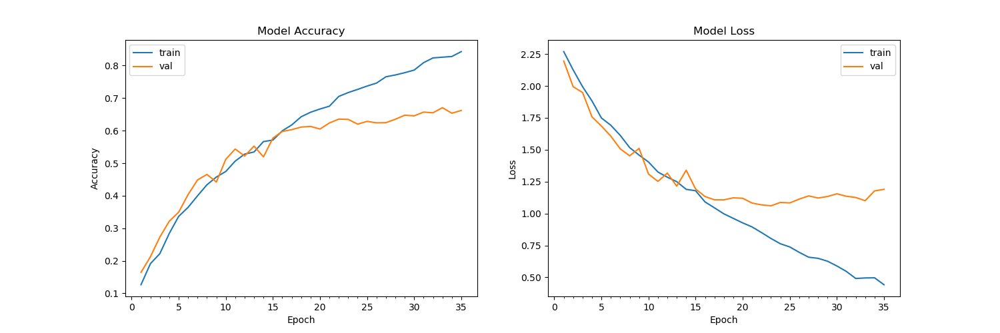

__Model 3__

Architecture: 4 Layers, Batch: 100, Epochs: 30, Test Accuracy: .613, Test Loss: 1.67

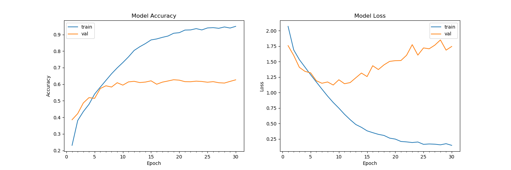


__Model 4__

Architecture: Base, Batch: 100, Epochs: 35, Test Accuracy: .656, Test Loss: 1.22

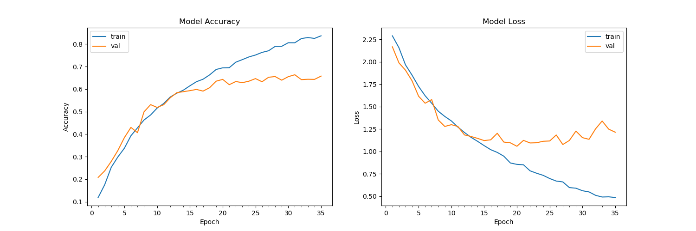

__Model 5: Resnet__

Architecture: 3 layers, Batch: 250, Epochs: 30, Test Accuracy: .511, Test Loss: 2.21

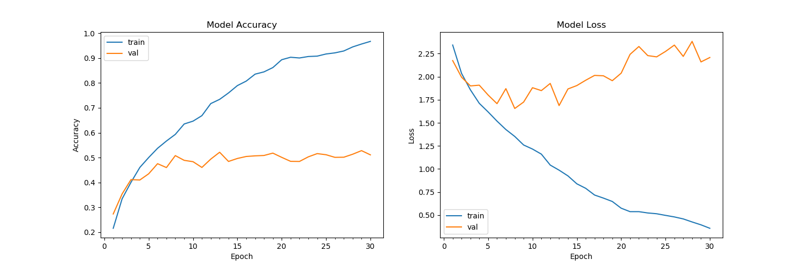

_This model seemed to overfit quickly. With more time, we would test different types of model decay, levels of dropout, and batch sizes._


 __Predictions Examples - Taken from Model 2 (Due to High Test Accuracy)__

 | Image | Real Category | Predicted Category |
 |-------|:-------:|------:|
 |  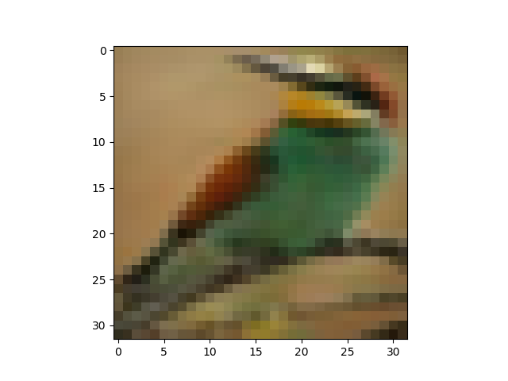 | bird | bird |
 |  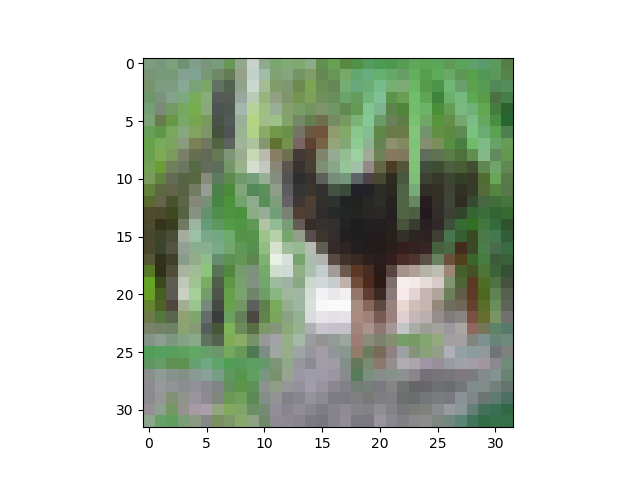| cat | deer |
 |  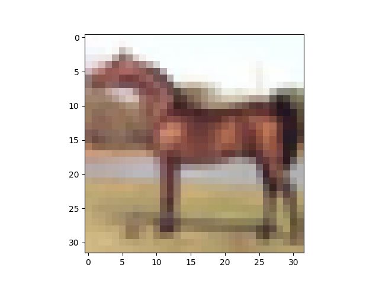| horse| horse |
 |  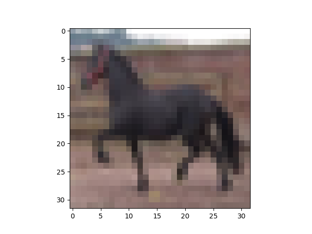 |horse | horse |
 |  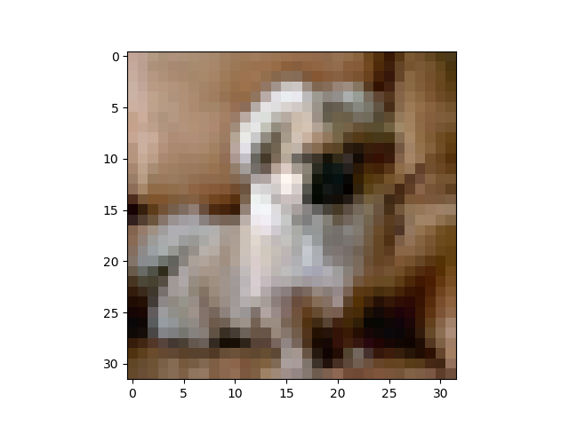 | dog | dog |
 |  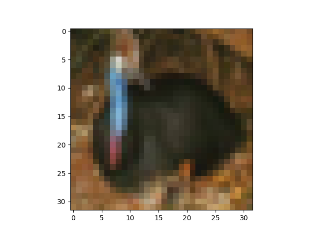 |bird | bird |
 |  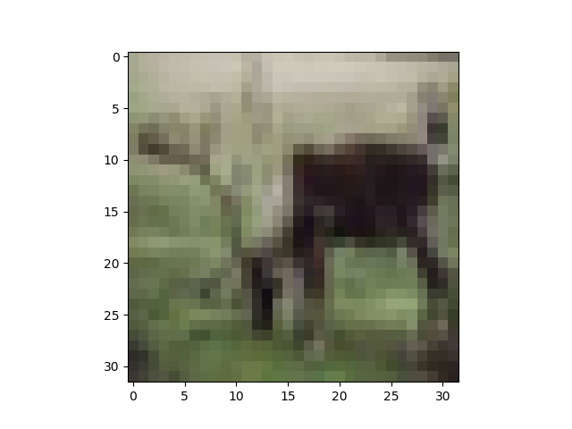 | horse| deer |
 |  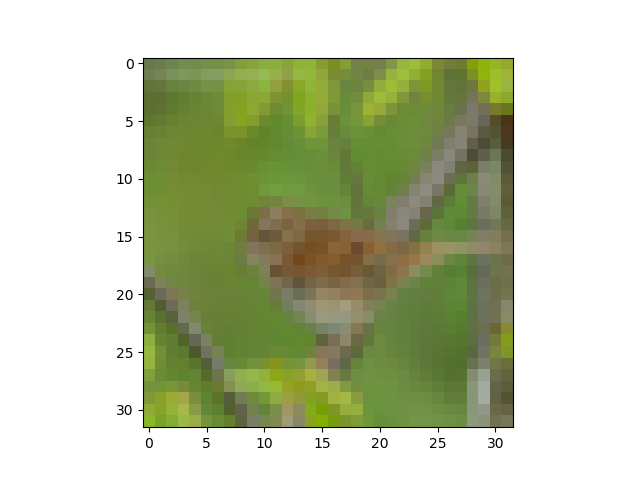 | bird| bird |
 |  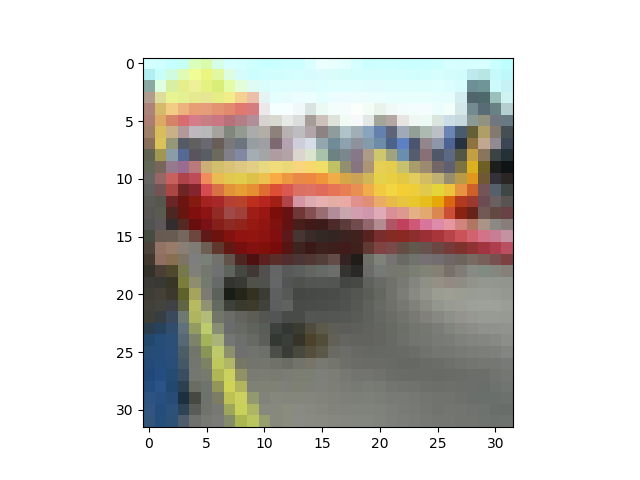 |truck | airplane |

### Future Work

- Use the entire dataset to train the model (60,000 photos)
- Use different base architectures for the convolutional neural network.
- Figure out how to utilize other resnet and Googlenet models.
- Use more epochs and smaller batch sizes (especially with Resnet, which was extremely time-intensive)
- Try other methods to prevent overfitting (weight-decay)

### Source Code
- [case_studyCNN.py](https://github.com/evanhosmer/ds-deep-learning-case-study/blob/master/case_studyCNN.py): Original cleaning, architecture and modeling (credit to [parneetk](https://github.com/parneetk/Neural-Networks-in-Keras/blob/master/03_CNN_CIFAR10.ipynb) on Github)
- [resnet.py](https://github.com/evanhosmer/ds-deep-learning-case-study/blob/master/resnet.py): Resnet architecture and modeling (credit to [Microsoft research team](https://arxiv.org/pdf/1512.03385.pdf))
